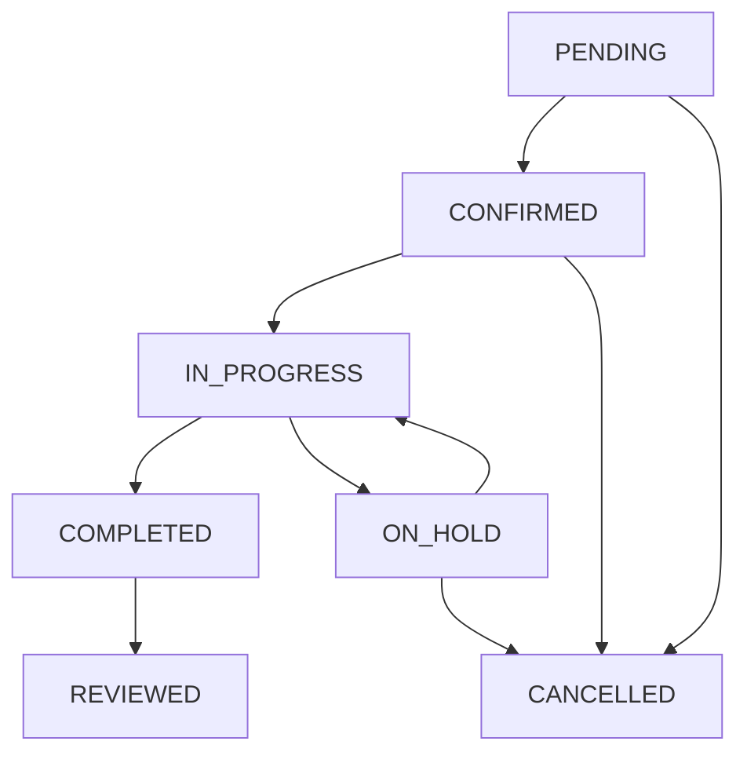

# Booking API Documentation

## Overview
The Booking API handles all appointment scheduling and management operations in the Shop Experts platform.

## Base URL
```
http://localhost:8080/api/v1/bookings
```

## Endpoints

### 1. Create Booking
**POST** `/`

Creates a new booking for a customer.

#### Request Headers
```
Content-Type: application/json
Authorization: Bearer {token}
```

#### Request Body
```json
{
  "customerId": "12345",
  "shopId": "shop-001",
  "serviceId": "service-123",
  "preferredDate": "2024-01-15T10:00:00",
  "alternativeDates": [
    "2024-01-16T10:00:00",
    "2024-01-17T14:00:00"
  ],
  "vehicleInfo": {
    "make": "Toyota",
    "model": "Camry",
    "year": 2020,
    "vin": "1HGBH41JXMN109186",
    "licensePlate": "ABC123"
  },
  "serviceDetails": {
    "description": "Oil change and tire rotation",
    "estimatedDuration": 90,
    "priority": "NORMAL"
  },
  "customerNotes": "Please call before starting work"
}
```

#### Response (201 Created)
```json
{
  "id": "booking-789",
  "customerId": "12345",
  "shopId": "shop-001",
  "serviceId": "service-123",
  "status": "PENDING",
  "scheduledDate": "2024-01-15T10:00:00",
  "estimatedCompletion": "2024-01-15T11:30:00",
  "vehicleInfo": {
    "make": "Toyota",
    "model": "Camry",
    "year": 2020,
    "vin": "1HGBH41JXMN109186",
    "licensePlate": "ABC123"
  },
  "serviceDetails": {
    "name": "Oil Change & Tire Rotation",
    "description": "Oil change and tire rotation",
    "estimatedDuration": 90,
    "estimatedCost": 75.00,
    "priority": "NORMAL"
  },
  "shopInfo": {
    "name": "Bob's Auto Shop",
    "address": "123 Main St, City, State 12345",
    "phone": "(555) 123-4567"
  },
  "customerNotes": "Please call before starting work",
  "createdAt": "2024-01-10T14:30:00",
  "updatedAt": "2024-01-10T14:30:00"
}
```

### 2. Get Booking Details
**GET** `/{bookingId}`

Retrieves detailed information about a specific booking.

#### Response (200 OK)
```json
{
  "id": "booking-789",
  "customerId": "12345",
  "shopId": "shop-001",
  "serviceId": "service-123",
  "status": "IN_PROGRESS",
  "scheduledDate": "2024-01-15T10:00:00",
  "actualStartTime": "2024-01-15T10:15:00",
  "estimatedCompletion": "2024-01-15T11:30:00",
  "progress": {
    "currentStep": "Oil Change",
    "completedSteps": ["Vehicle Inspection"],
    "remainingSteps": ["Tire Rotation", "Final Inspection"],
    "percentComplete": 25
  },
  "vehicleInfo": {
    "make": "Toyota",
    "model": "Camry",
    "year": 2020,
    "vin": "1HGBH41JXMN109186",
    "licensePlate": "ABC123"
  },
  "serviceDetails": {
    "name": "Oil Change & Tire Rotation",
    "description": "Oil change and tire rotation",
    "estimatedDuration": 90,
    "estimatedCost": 75.00,
    "actualCost": 78.50,
    "priority": "NORMAL"
  },
  "assignedTechnician": {
    "id": "tech-456",
    "name": "John Smith",
    "certification": "ASE Certified"
  },
  "timeline": [
    {
      "timestamp": "2024-01-10T14:30:00",
      "event": "BOOKING_CREATED",
      "description": "Booking created by customer"
    },
    {
      "timestamp": "2024-01-14T16:00:00",
      "event": "BOOKING_CONFIRMED",
      "description": "Booking confirmed by shop"
    },
    {
      "timestamp": "2024-01-15T10:15:00",
      "event": "SERVICE_STARTED",
      "description": "Service started by John Smith"
    }
  ],
  "customerNotes": "Please call before starting work",
  "shopNotes": "Customer vehicle arrived on time",
  "createdAt": "2024-01-10T14:30:00",
  "updatedAt": "2024-01-15T10:15:00"
}
```

### 3. Update Booking
**PUT** `/{bookingId}`

Updates an existing booking.

#### Request Body
```json
{
  "scheduledDate": "2024-01-16T10:00:00",
  "serviceDetails": {
    "description": "Oil change, tire rotation, and brake inspection",
    "estimatedDuration": 120
  },
  "customerNotes": "Added brake inspection request"
}
```

#### Response (200 OK)
```json
{
  "id": "booking-789",
  "status": "UPDATED",
  "scheduledDate": "2024-01-16T10:00:00",
  "estimatedCompletion": "2024-01-16T12:00:00",
  "serviceDetails": {
    "description": "Oil change, tire rotation, and brake inspection",
    "estimatedDuration": 120,
    "estimatedCost": 95.00
  },
  "updatedAt": "2024-01-10T16:45:00"
}
```

### 4. Cancel Booking
**DELETE** `/{bookingId}`

Cancels an existing booking.

#### Request Body
```json
{
  "reason": "Customer request",
  "cancellationNotes": "Customer found a closer shop"
}
```

#### Response (200 OK)
```json
{
  "id": "booking-789",
  "status": "CANCELLED",
  "cancellationReason": "Customer request",
  "cancellationNotes": "Customer found a closer shop",
  "cancelledAt": "2024-01-10T17:00:00",
  "refundAmount": 0.00,
  "cancellationFee": 0.00
}
```

### 5. Get Customer Bookings
**GET** `/customer/{customerId}`

Retrieves all bookings for a specific customer.

#### Query Parameters
- `status` (optional): Filter by booking status
- `fromDate` (optional): Filter bookings from this date
- `toDate` (optional): Filter bookings until this date
- `page` (optional): Page number (default: 0)
- `size` (optional): Page size (default: 10)

#### Response (200 OK)
```json
{
  "content": [
    {
      "id": "booking-789",
      "shopName": "Bob's Auto Shop",
      "serviceName": "Oil Change & Tire Rotation",
      "status": "COMPLETED",
      "scheduledDate": "2024-01-15T10:00:00",
      "completedDate": "2024-01-15T11:45:00",
      "totalCost": 78.50,
      "vehicleInfo": {
        "make": "Toyota",
        "model": "Camry",
        "year": 2020
      }
    }
  ],
  "pageable": {
    "page": 0,
    "size": 10,
    "totalElements": 1,
    "totalPages": 1
  }
}
```

### 6. Get Shop Bookings
**GET** `/shop/{shopId}`

Retrieves all bookings for a specific shop.

#### Query Parameters
- `status` (optional): Filter by booking status
- `date` (optional): Filter by specific date
- `technician` (optional): Filter by assigned technician
- `page` (optional): Page number (default: 0)
- `size` (optional): Page size (default: 10)

#### Response (200 OK)
```json
{
  "content": [
    {
      "id": "booking-789",
      "customerName": "Jane Doe",
      "serviceName": "Oil Change & Tire Rotation",
      "status": "SCHEDULED",
      "scheduledDate": "2024-01-15T10:00:00",
      "estimatedDuration": 90,
      "assignedTechnician": "John Smith",
      "vehicleInfo": {
        "make": "Toyota",
        "model": "Camry",
        "licensePlate": "ABC123"
      },
      "priority": "NORMAL"
    }
  ],
  "pageable": {
    "page": 0,
    "size": 10,
    "totalElements": 1,
    "totalPages": 1
  }
}
```

### 7. Update Booking Status
**PATCH** `/{bookingId}/status`

Updates the status of a booking.

#### Request Body
```json
{
  "status": "IN_PROGRESS",
  "notes": "Service started",
  "estimatedCompletion": "2024-01-15T11:30:00"
}
```

#### Response (200 OK)
```json
{
  "id": "booking-789",
  "status": "IN_PROGRESS",
  "updatedAt": "2024-01-15T10:15:00",
  "statusHistory": [
    {
      "status": "PENDING",
      "timestamp": "2024-01-10T14:30:00"
    },
    {
      "status": "CONFIRMED",
      "timestamp": "2024-01-14T16:00:00"
    },
    {
      "status": "IN_PROGRESS",
      "timestamp": "2024-01-15T10:15:00"
    }
  ]
}
```

## Booking Status Flow



## Error Responses

### 400 Bad Request
```json
{
  "error": "VALIDATION_ERROR",
  "message": "Invalid booking data",
  "details": [
    {
      "field": "scheduledDate",
      "message": "Scheduled date cannot be in the past"
    },
    {
      "field": "serviceId",
      "message": "Service ID is required"
    }
  ],
  "timestamp": "2024-01-10T14:30:00"
}
```

### 404 Not Found
```json
{
  "error": "BOOKING_NOT_FOUND",
  "message": "Booking with ID 'booking-999' not found",
  "timestamp": "2024-01-10T14:30:00"
}
```

### 409 Conflict
```json
{
  "error": "BOOKING_CONFLICT",
  "message": "Time slot is no longer available",
  "suggestedAlternatives": [
    "2024-01-15T11:00:00",
    "2024-01-15T14:00:00",
    "2024-01-16T10:00:00"
  ],
  "timestamp": "2024-01-10T14:30:00"
}
```

## Business Rules

1. **Booking Creation**:
   - Must be at least 2 hours in advance
   - Cannot exceed 30 days in the future
   - Shop must be available during requested time

2. **Cancellation Policy**:
   - Free cancellation up to 24 hours before appointment
   - 50% fee for cancellations within 24 hours
   - No refund for no-shows

3. **Rescheduling**:
   - Allowed up to 2 times per booking
   - Must maintain minimum advance notice

4. **Status Transitions**:
   - Only specific status transitions are allowed
   - Some transitions require additional permissions

## Integration Points

- **Notification Service**: Sends SMS/email updates
- **Payment Service**: Handles deposits and payments
- **Calendar Service**: Manages shop availability
- **Inventory Service**: Checks parts availability
