# Backend Architecture

## Spring Boot Application Structure

The backend follows a layered architecture pattern with clear separation of concerns.

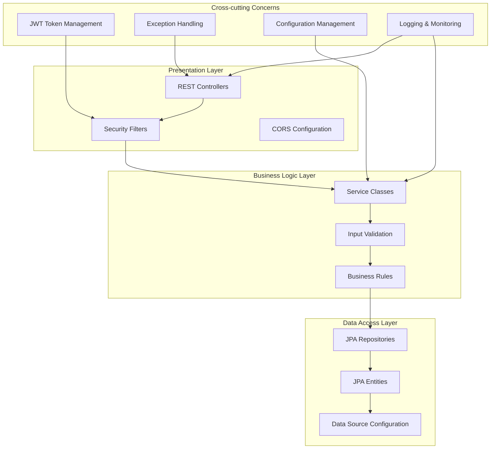

## Component Architecture

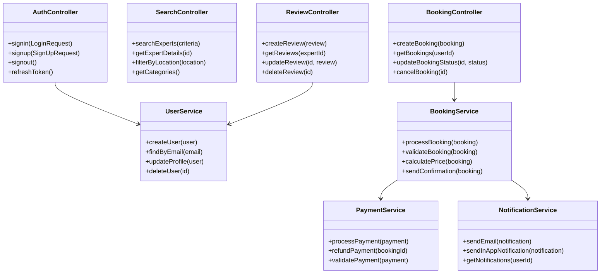

## Security Architecture

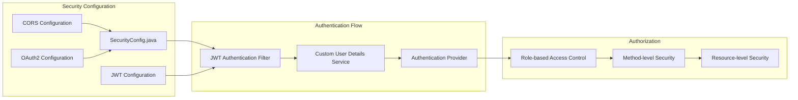

## Database Design

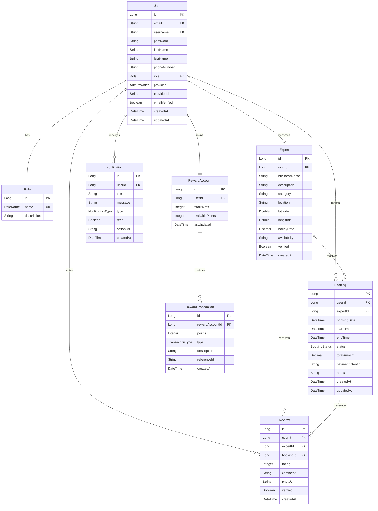

## API Layer Architecture

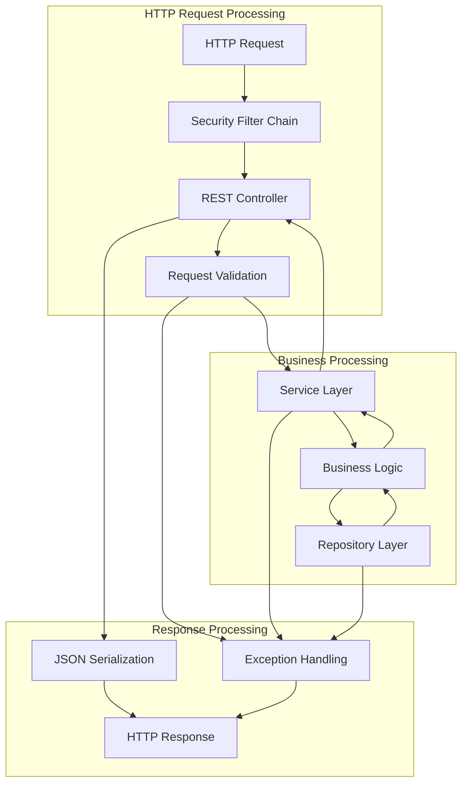

## Service Layer Design

### Authentication Service Flow
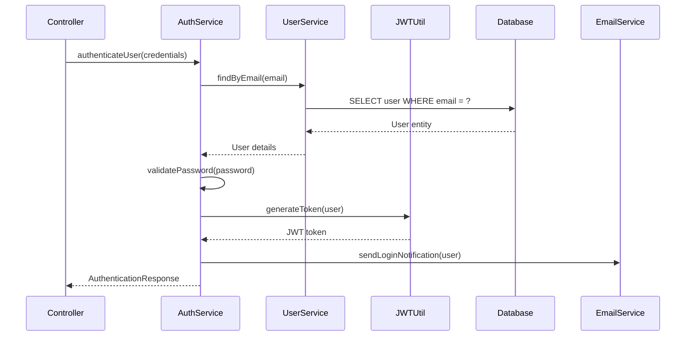

### Booking Service Flow
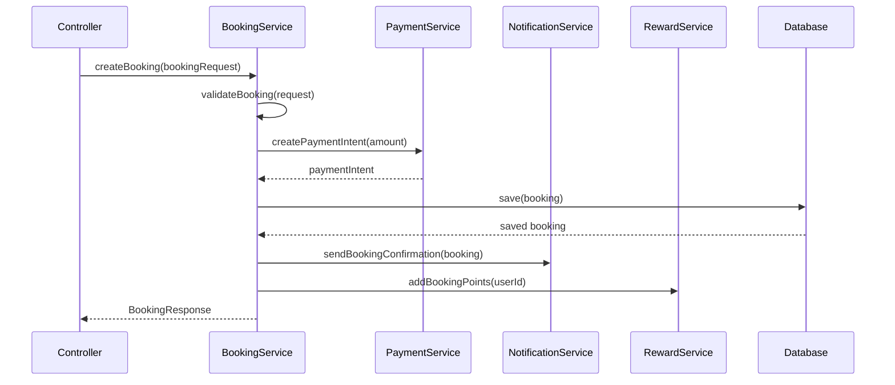

## Configuration Management

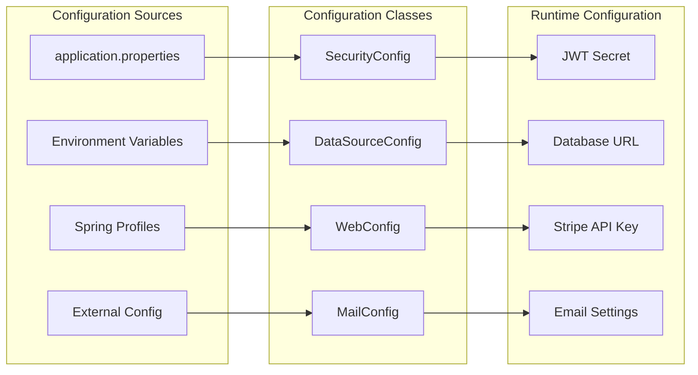

## Exception Handling Strategy

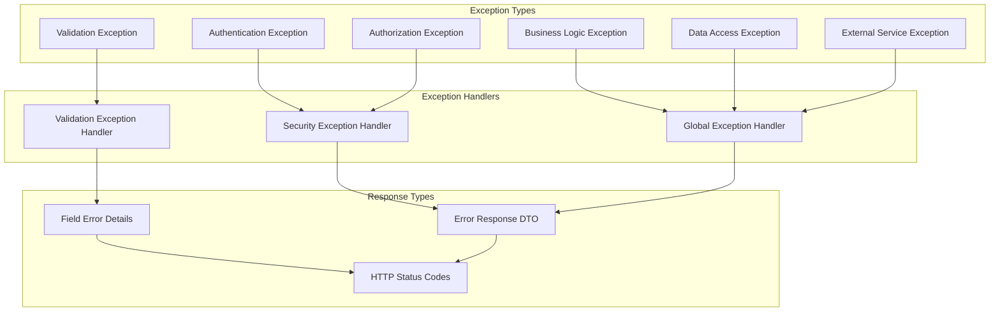

## Testing Architecture

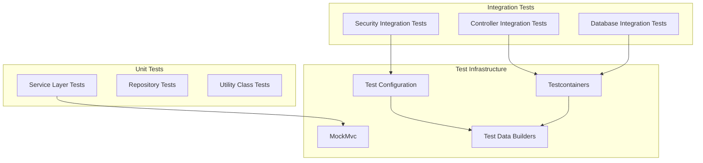

## Performance Optimization

### Database Optimization
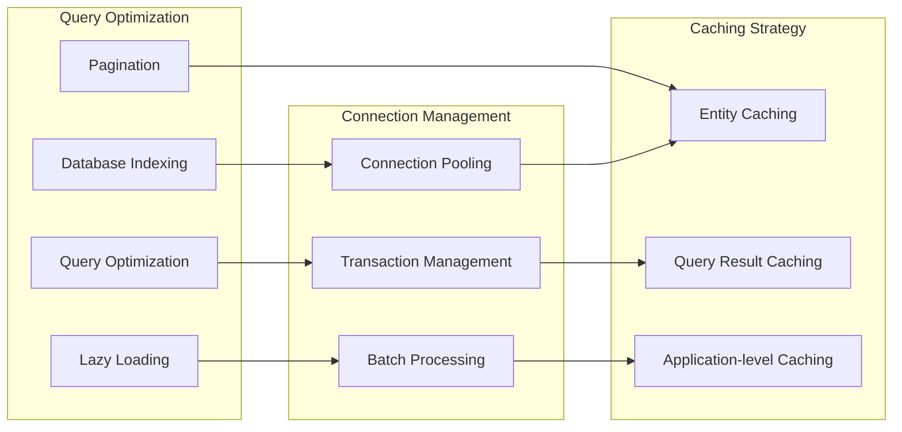

## Deployment Configuration

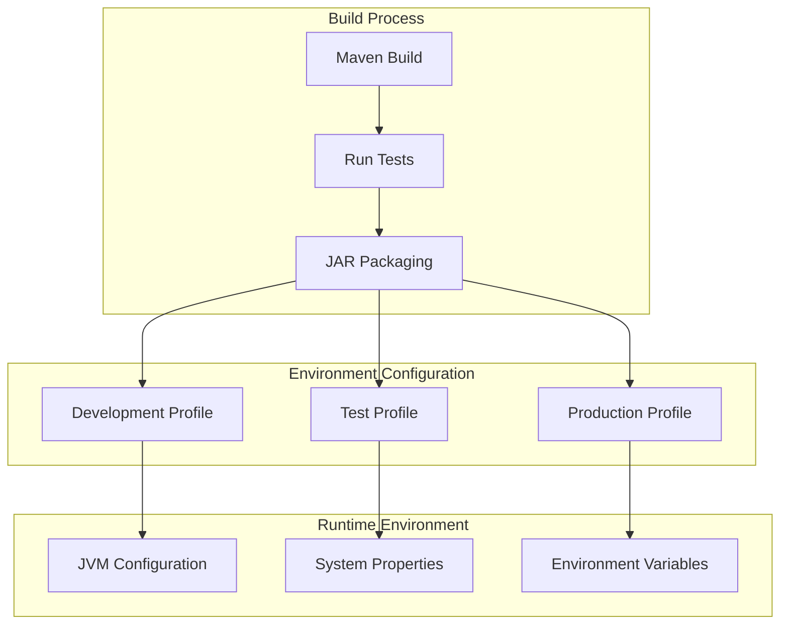
