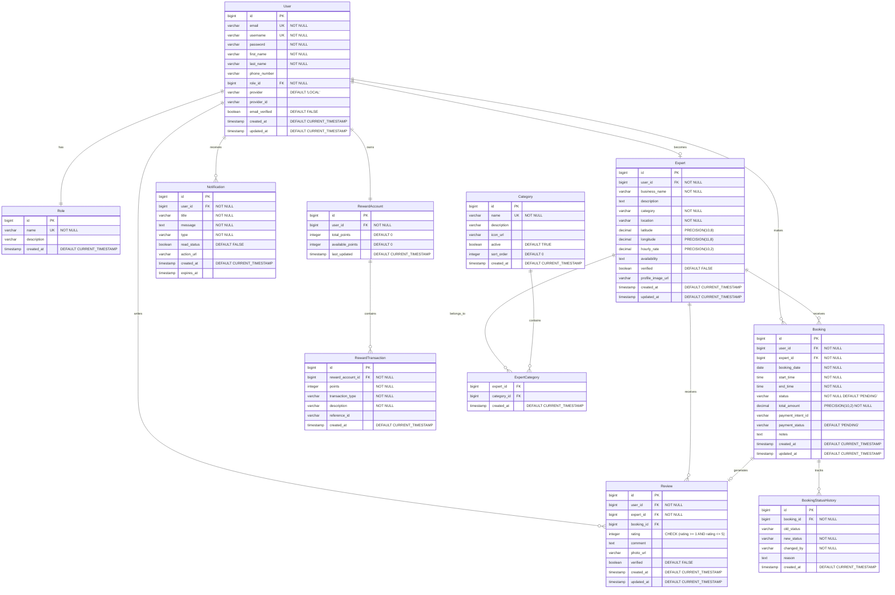
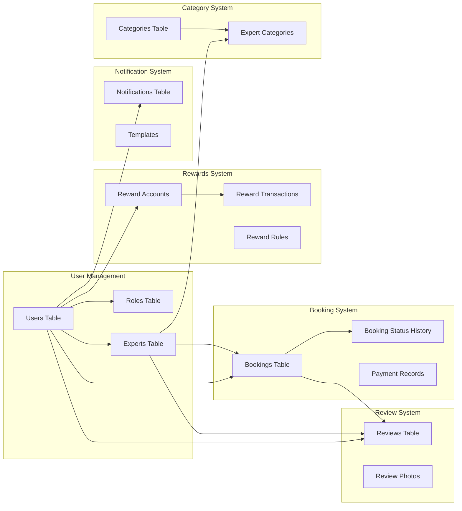
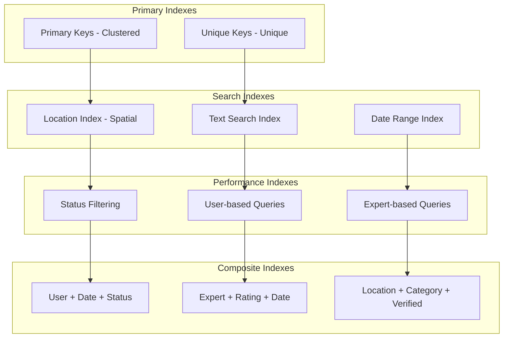
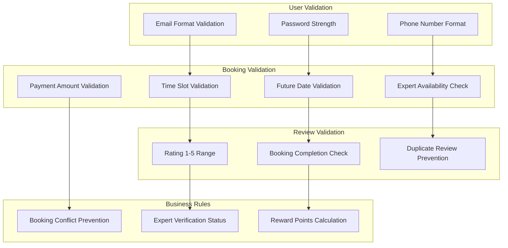
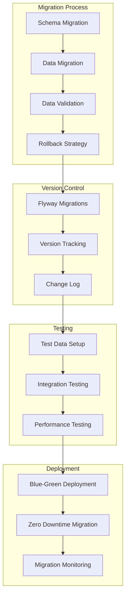
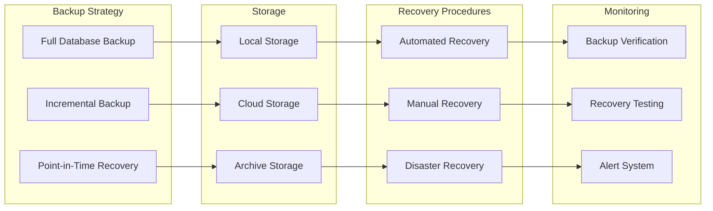

# Database Design and Schema

## Entity Relationship Diagram



## Database Schema Details

### Core Tables

#### Users Table
```sql
CREATE TABLE users (
    id BIGINT AUTO_INCREMENT PRIMARY KEY,
    email VARCHAR(255) NOT NULL UNIQUE,
    username VARCHAR(100) NOT NULL UNIQUE,
    password VARCHAR(255) NOT NULL,
    first_name VARCHAR(100) NOT NULL,
    last_name VARCHAR(100) NOT NULL,
    phone_number VARCHAR(20),
    role_id BIGINT NOT NULL,
    provider VARCHAR(50) DEFAULT 'LOCAL',
    provider_id VARCHAR(255),
    email_verified BOOLEAN DEFAULT FALSE,
    profile_image_url VARCHAR(500),
    created_at TIMESTAMP DEFAULT CURRENT_TIMESTAMP,
    updated_at TIMESTAMP DEFAULT CURRENT_TIMESTAMP ON UPDATE CURRENT_TIMESTAMP,
    
    FOREIGN KEY (role_id) REFERENCES roles(id),
    INDEX idx_email (email),
    INDEX idx_username (username),
    INDEX idx_provider (provider, provider_id)
);
```

#### Experts Table
```sql
CREATE TABLE experts (
    id BIGINT AUTO_INCREMENT PRIMARY KEY,
    user_id BIGINT NOT NULL,
    business_name VARCHAR(255) NOT NULL,
    description TEXT,
    location VARCHAR(255) NOT NULL,
    latitude DECIMAL(10,8),
    longitude DECIMAL(11,8),
    hourly_rate DECIMAL(10,2),
    availability TEXT,
    verified BOOLEAN DEFAULT FALSE,
    profile_image_url VARCHAR(500),
    created_at TIMESTAMP DEFAULT CURRENT_TIMESTAMP,
    updated_at TIMESTAMP DEFAULT CURRENT_TIMESTAMP ON UPDATE CURRENT_TIMESTAMP,
    
    FOREIGN KEY (user_id) REFERENCES users(id) ON DELETE CASCADE,
    UNIQUE KEY uk_expert_user (user_id),
    INDEX idx_location (latitude, longitude),
    INDEX idx_verified (verified),
    INDEX idx_hourly_rate (hourly_rate)
);
```

#### Bookings Table
```sql
CREATE TABLE bookings (
    id BIGINT AUTO_INCREMENT PRIMARY KEY,
    user_id BIGINT NOT NULL,
    expert_id BIGINT NOT NULL,
    booking_date DATE NOT NULL,
    start_time TIME NOT NULL,
    end_time TIME NOT NULL,
    status VARCHAR(50) NOT NULL DEFAULT 'PENDING',
    total_amount DECIMAL(10,2) NOT NULL,
    payment_intent_id VARCHAR(255),
    payment_status VARCHAR(50) DEFAULT 'PENDING',
    notes TEXT,
    created_at TIMESTAMP DEFAULT CURRENT_TIMESTAMP,
    updated_at TIMESTAMP DEFAULT CURRENT_TIMESTAMP ON UPDATE CURRENT_TIMESTAMP,
    
    FOREIGN KEY (user_id) REFERENCES users(id),
    FOREIGN KEY (expert_id) REFERENCES experts(id),
    INDEX idx_user_bookings (user_id, booking_date),
    INDEX idx_expert_bookings (expert_id, booking_date),
    INDEX idx_booking_status (status),
    INDEX idx_booking_date (booking_date),
    
    CONSTRAINT chk_booking_time CHECK (start_time < end_time),
    CONSTRAINT chk_booking_status CHECK (status IN ('PENDING', 'CONFIRMED', 'COMPLETED', 'CANCELLED', 'REFUNDED'))
);
```

### Data Relationships



## Indexing Strategy



### Key Indexes

```sql
-- Location-based search optimization
CREATE INDEX idx_expert_location ON experts(latitude, longitude, verified);

-- Booking queries optimization
CREATE INDEX idx_booking_user_date ON bookings(user_id, booking_date, status);
CREATE INDEX idx_booking_expert_date ON bookings(expert_id, booking_date, status);

-- Review queries optimization
CREATE INDEX idx_review_expert_rating ON reviews(expert_id, rating, created_at);

-- Search optimization
CREATE INDEX idx_expert_search ON experts(verified, category, hourly_rate);

-- Notification queries
CREATE INDEX idx_notification_user_unread ON notifications(user_id, read_status, created_at);
```

## Data Validation Rules



## Database Constraints

### Check Constraints
```sql
-- Rating validation
ALTER TABLE reviews ADD CONSTRAINT chk_rating 
CHECK (rating >= 1 AND rating <= 5);

-- Booking time validation
ALTER TABLE bookings ADD CONSTRAINT chk_booking_time 
CHECK (start_time < end_time);

-- Positive amounts
ALTER TABLE bookings ADD CONSTRAINT chk_positive_amount 
CHECK (total_amount > 0);

-- Latitude/Longitude bounds
ALTER TABLE experts ADD CONSTRAINT chk_latitude 
CHECK (latitude >= -90 AND latitude <= 90);

ALTER TABLE experts ADD CONSTRAINT chk_longitude 
CHECK (longitude >= -180 AND longitude <= 180);
```

### Foreign Key Constraints
```sql
-- Cascading deletes for user-related data
ALTER TABLE experts ADD CONSTRAINT fk_expert_user 
FOREIGN KEY (user_id) REFERENCES users(id) ON DELETE CASCADE;

ALTER TABLE bookings ADD CONSTRAINT fk_booking_user 
FOREIGN KEY (user_id) REFERENCES users(id) ON DELETE RESTRICT;

ALTER TABLE bookings ADD CONSTRAINT fk_booking_expert 
FOREIGN KEY (expert_id) REFERENCES experts(id) ON DELETE RESTRICT;
```

## Query Optimization Patterns

### Common Query Patterns

```sql
-- Expert search with location and filters
SELECT e.*, u.first_name, u.last_name, 
       AVG(r.rating) as avg_rating,
       COUNT(r.id) as review_count
FROM experts e
JOIN users u ON e.user_id = u.id
LEFT JOIN reviews r ON e.id = r.expert_id
WHERE e.verified = true
  AND e.latitude BETWEEN ? AND ?
  AND e.longitude BETWEEN ? AND ?
  AND e.category = ?
GROUP BY e.id
HAVING avg_rating >= ?
ORDER BY avg_rating DESC, review_count DESC
LIMIT ? OFFSET ?;

-- User booking history with expert details
SELECT b.*, e.business_name, u.first_name, u.last_name
FROM bookings b
JOIN experts e ON b.expert_id = e.id
JOIN users u ON e.user_id = u.id
WHERE b.user_id = ?
ORDER BY b.booking_date DESC, b.start_time DESC;

-- Expert dashboard - upcoming bookings
SELECT b.*, u.first_name, u.last_name, u.phone_number
FROM bookings b
JOIN users u ON b.user_id = u.id
WHERE b.expert_id = ?
  AND b.booking_date >= CURDATE()
  AND b.status IN ('PENDING', 'CONFIRMED')
ORDER BY b.booking_date ASC, b.start_time ASC;
```

## Data Migration Strategy



## Backup and Recovery



## Performance Monitoring

### Database Metrics
- Query execution time
- Index usage statistics
- Connection pool metrics
- Database size and growth
- Lock wait times
- Cache hit ratios

### Optimization Recommendations
- Regular ANALYZE TABLE for query optimizer
- Periodic index maintenance
- Query plan analysis for slow queries
- Connection pool tuning
- Database parameter optimization
