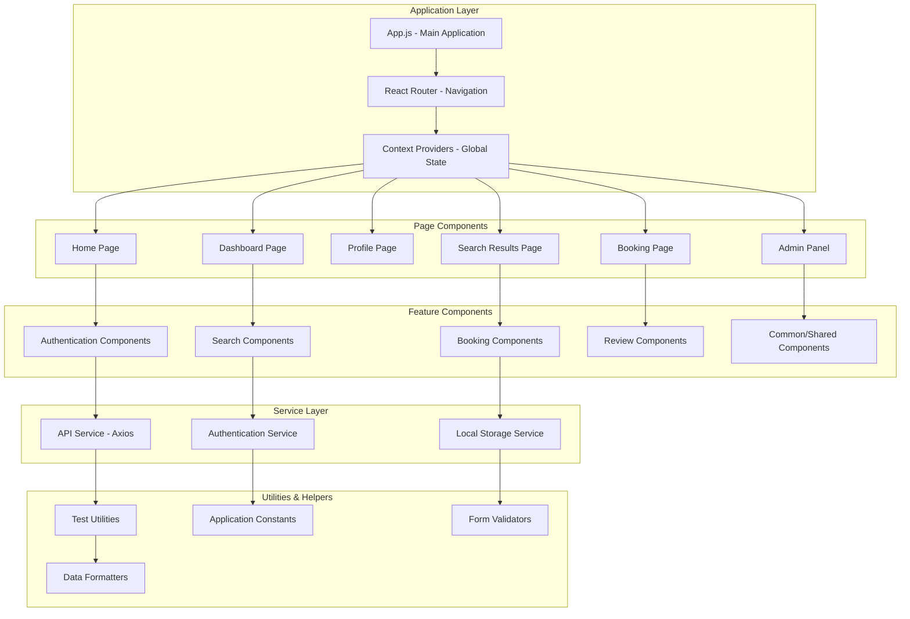
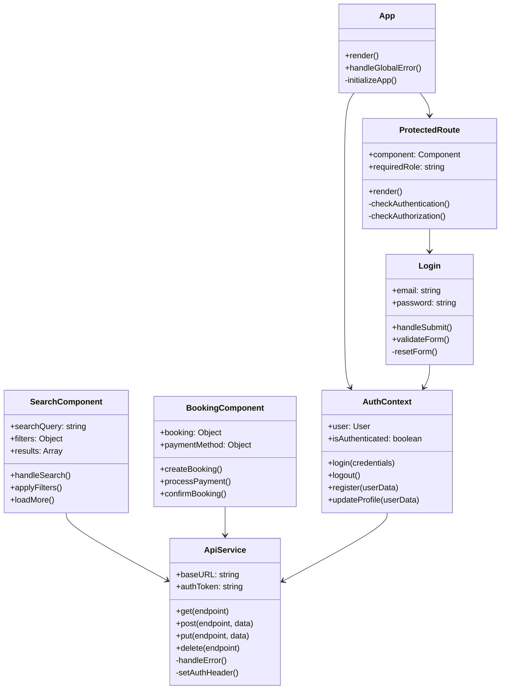
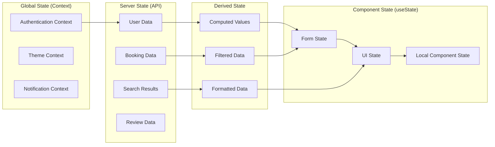
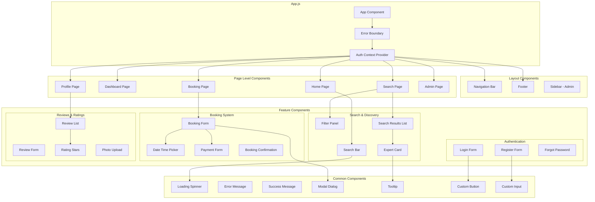
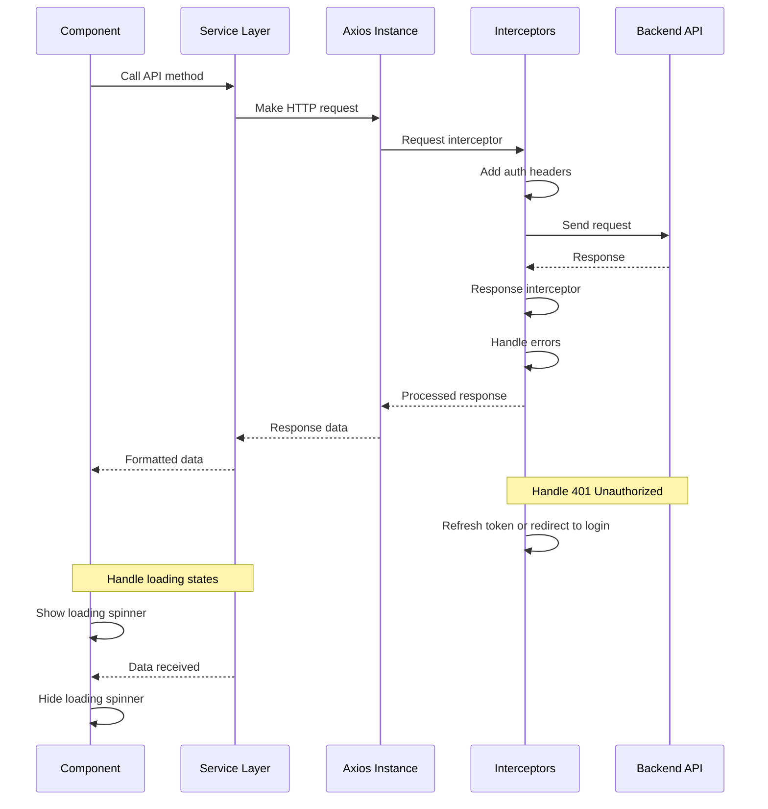
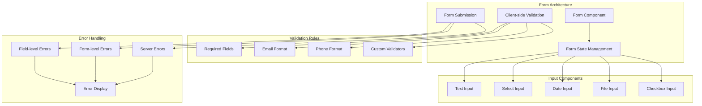
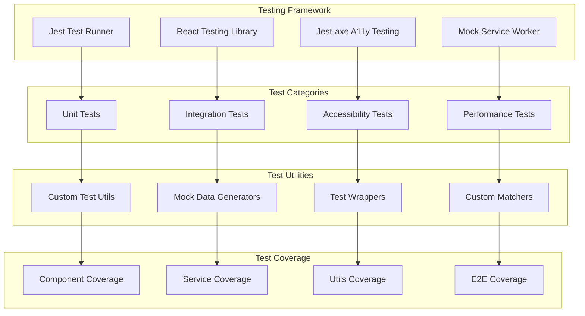
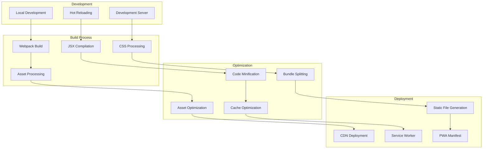
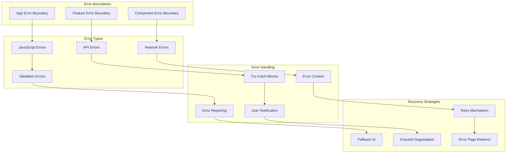

# Frontend Architecture

## React Application Structure

The frontend follows a component-based architecture with clear separation of concerns and modern React patterns.



## Component Architecture



## State Management Architecture



## Component Hierarchy



## Routing Architecture

```mermaid
graph TB
    subgraph "Router Configuration"
        BrowserRouter[Browser Router]
        Routes[Routes Configuration]
        ProtectedRoute[Protected Route Wrapper]
    end
    
    subgraph "Public Routes"
        HomeRoute[/ - Home]
        LoginRoute[/login - Login]
        RegisterRoute[/register - Register]
        SearchRoute[/search - Public Search]
    end
    
    subgraph "Protected Routes"
        DashboardRoute[/dashboard - User Dashboard]
        ProfileRoute[/profile - User Profile]
        BookingRoute[/booking - Create Booking]
        BookingsRoute[/bookings - My Bookings]
    end
    
    subgraph "Admin Routes"
        AdminRoute[/admin - Admin Dashboard]
        UsersRoute[/admin/users - User Management]
        AnalyticsRoute[/admin/analytics - Analytics]
    end
    
    subgraph "Route Guards"
        AuthGuard[Authentication Guard]
        RoleGuard[Role-based Guard]
        RedirectHandler[Redirect Handler]
    end
    
    BrowserRouter --> Routes
    Routes --> ProtectedRoute
    
    Routes --> HomeRoute
    Routes --> LoginRoute
    Routes --> RegisterRoute
    Routes --> SearchRoute
    
    ProtectedRoute --> DashboardRoute
    ProtectedRoute --> ProfileRoute
    ProtectedRoute --> BookingRoute
    ProtectedRoute --> BookingsRoute
    
    ProtectedRoute --> AdminRoute
    ProtectedRoute --> UsersRoute
    ProtectedRoute --> AnalyticsRoute
    
    ProtectedRoute --> AuthGuard
    AuthGuard --> RoleGuard
    RoleGuard --> RedirectHandler
```

## API Integration Architecture



## Form Management



## Testing Architecture



## Performance Optimization

```mermaid
graph LR
    subgraph "Code Splitting"
        LazyLoading[React.lazy()]
        RouteBasedSplitting[Route-based Splitting]
        ComponentSplitting[Component Splitting]
    end
    
    subgraph "Rendering Optimization"
        ReactMemo[React.memo()]
        UseMemo[useMemo Hook]
        UseCallback[useCallback Hook]
        VirtualScrolling[Virtual Scrolling]
    end
    
    subgraph "Bundle Optimization"
        TreeShaking[Tree Shaking]
        BundleAnalysis[Bundle Analysis]
        AssetOptimization[Asset Optimization]
        CompressionGzip[Gzip Compression]
    end
    
    subgraph "Runtime Performance"
        WebVitals[Web Vitals Monitoring]
        PerformanceAPI[Performance API]
        MemoryManagement[Memory Management]
        ImageOptimization[Image Optimization]
    end
    
    LazyLoading --> ReactMemo
    RouteBasedSplitting --> UseMemo
    ComponentSplitting --> UseCallback
    ReactMemo --> TreeShaking
    UseMemo --> BundleAnalysis
    UseCallback --> AssetOptimization
    VirtualScrolling --> CompressionGzip
    
    TreeShaking --> WebVitals
    BundleAnalysis --> PerformanceAPI
    AssetOptimization --> MemoryManagement
    CompressionGzip --> ImageOptimization
```

## Build and Deployment Process



## Error Handling Strategy


