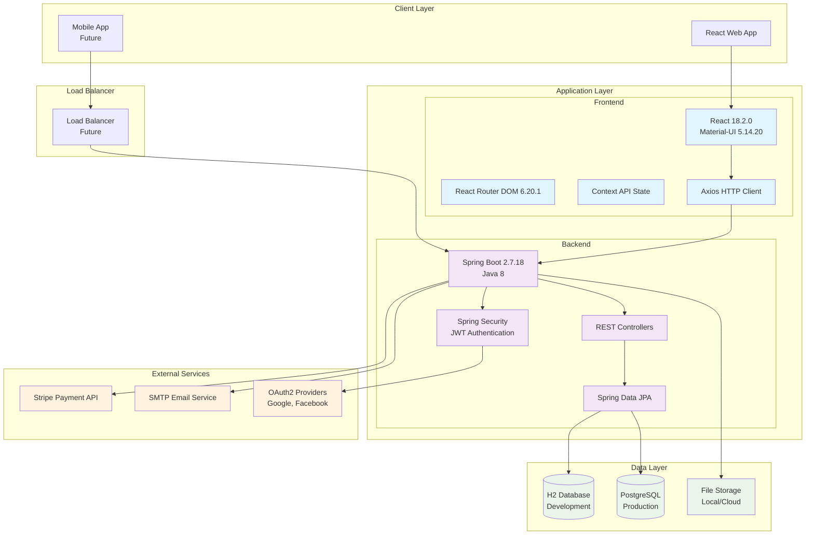
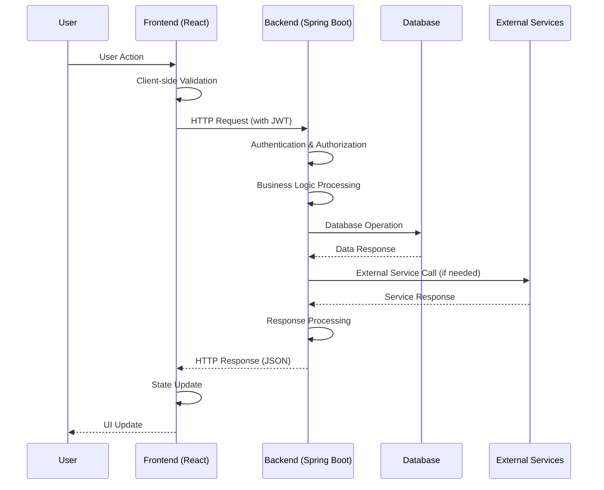
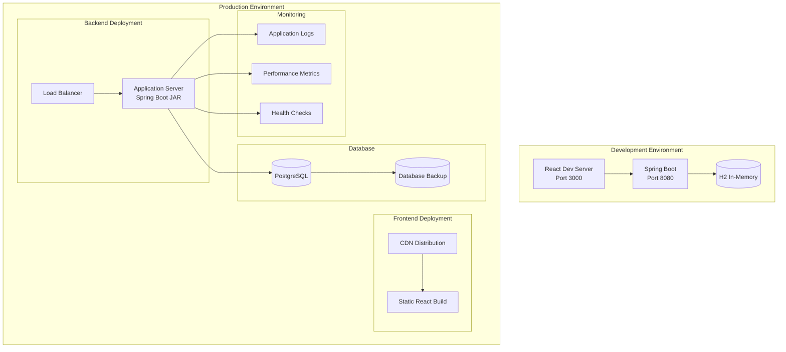

# System Architecture Overview

## High-Level Architecture

The Shop Experts platform follows a modern full-stack architecture with clear separation of concerns between the frontend, backend, and data layers.

## Technology Stack Summary

### Frontend Stack
- **Framework**: React 18.2.0 with functional components and hooks
- **UI Library**: Material-UI 5.14.20 for consistent design system
- **State Management**: React Context API for global state
- **Routing**: React Router DOM 6.20.1 for navigation
- **HTTP Client**: Axios 1.6.2 for API communication
- **Testing**: Jest + React Testing Library + Jest-axe for accessibility

### Backend Stack
- **Framework**: Spring Boot 2.7.18 with Java 8
- **Security**: Spring Security with JWT authentication
- **Database**: Spring Data JPA with H2 (dev) / PostgreSQL (prod)
- **API Design**: RESTful APIs with proper HTTP methods and status codes
- **Testing**: JUnit + Mockito + Testcontainers

### Integration & External Services
- **Authentication**: JWT tokens + OAuth2 social login
- **Payments**: Stripe integration for booking payments
- **Email**: SMTP integration for notifications
- **File Storage**: Local storage with cloud storage capability

## Core Components

### 1. User Management System
- User registration and authentication
- Profile management
- Role-based access control (User, Expert, Admin)
- Social login integration

### 2. Search & Discovery Engine
- Location-based search functionality
- Advanced filtering capabilities
- Expert/service categorization
- Real-time search suggestions

### 3. Booking & Payment System
- Service booking workflow
- Payment processing with Stripe
- Booking status management
- Calendar integration

### 4. Review & Rating System
- Customer feedback collection
- Rating aggregation
- Photo upload capabilities
- Review moderation

### 5. Notification System
- Real-time notifications
- Email notifications
- Push notification capability (future)
- Notification preferences

### 6. Rewards & Loyalty Program
- Points-based reward system
- Referral tracking
- Loyalty benefits
- Transaction history

### 7. Admin Dashboard
- User and expert management
- Analytics and reporting
- Content moderation
- System configuration

## Security Architecture

```mermaid
graph LR
    subgraph "Authentication Flow"
        Login[User Login] --> Validate[Credential Validation]
        Validate --> JWT[Generate JWT Token]
        JWT --> Response[Return Token + User Info]
    end
    
    subgraph "Authorization Flow"
        Request[API Request] --> Token[Extract JWT Token]
        Token --> Verify[Verify Token Signature]
        Verify --> Roles[Check User Roles]
        Roles --> Access[Grant/Deny Access]
    end
    
    subgraph "Security Layers"
        CORS[CORS Protection]
        CSRF[CSRF Protection]
        Encryption[Data Encryption]
        Validation[Input Validation]
    end
    
    Login --> Request
    Response --> Request
    Access --> CORS
    CORS --> CSRF
    CSRF --> Encryption
    Encryption --> Validation
```

## Data Flow Architecture

## Deployment Architecture

## Key Architectural Decisions

### 1. Monorepo Structure
- **Decision**: Single repository for both frontend and backend
- **Rationale**: Simplified development, shared documentation, coordinated releases
- **Trade-offs**: Larger repository size, but better code organization

### 2. JWT Authentication
- **Decision**: Stateless JWT tokens for authentication
- **Rationale**: Scalable, stateless, works well with REST APIs
- **Trade-offs**: Token size vs. server-side session complexity

### 3. React Context for State Management
- **Decision**: React Context API instead of Redux
- **Rationale**: Simpler setup, sufficient for current complexity
- **Trade-offs**: Less powerful than Redux, but adequate for current needs

### 4. H2 for Development, PostgreSQL for Production
- **Decision**: Different databases for different environments
- **Rationale**: Fast development iteration with H2, production reliability with PostgreSQL
- **Trade-offs**: Environment parity vs. development speed

### 5. Material-UI Component Library
- **Decision**: Use Material-UI instead of custom CSS
- **Rationale**: Consistent design system, accessibility built-in, faster development
- **Trade-offs**: Bundle size vs. development speed and consistency

## Performance Considerations

### Frontend Performance
- Code splitting with React lazy loading
- Image optimization and lazy loading
- Bundle size optimization
- Web Vitals monitoring

### Backend Performance
- Database query optimization
- Caching strategies (future enhancement)
- Connection pooling
- API response optimization

### Infrastructure Performance
- CDN for static asset delivery
- Database indexing strategies
- Load balancing for horizontal scaling
- Monitoring and alerting systems

## Scalability Roadmap

### Phase 1: Current Implementation
- Single instance deployment
- Basic monitoring
- Manual scaling

### Phase 2: Enhanced Reliability
- Load balancer implementation
- Database clustering
- Automated backups
- Health monitoring

### Phase 3: Full Scalability
- Microservices architecture consideration
- Caching layer (Redis)
- Message queuing system
- Auto-scaling infrastructure
