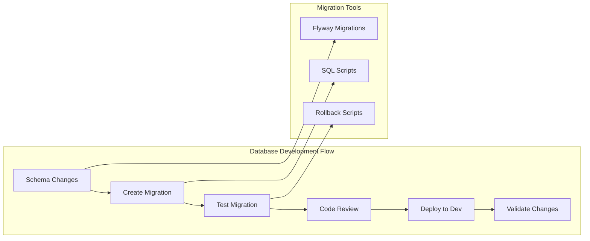
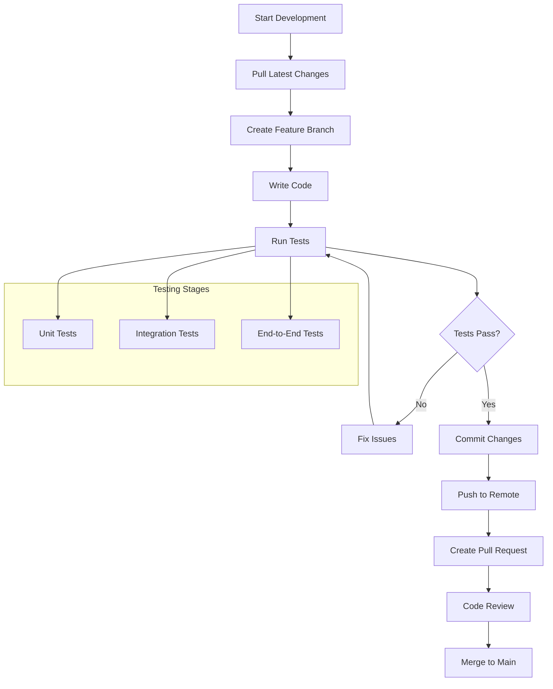
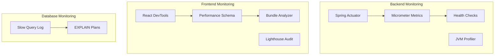

# Development Setup Guide

This guide provides detailed instructions for setting up a complete development environment for the Shop Experts platform.

## Table of Contents

- [Prerequisites](#prerequisites)
- [Development Environment Setup](#development-environment-setup)
- [IDE Configuration](#ide-configuration)
- [Database Setup](#database-setup)
- [Application Configuration](#application-configuration)
- [Development Workflow](#development-workflow)
- [Debugging and Troubleshooting](#debugging-and-troubleshooting)

## Prerequisites

### Required Software

1. **Java Development Kit (JDK)**
   ```bash
   # Install OpenJDK 17 or higher
   # macOS with Homebrew
   brew install openjdk@17
   
   # Ubuntu/Debian
   sudo apt update
   sudo apt install openjdk-17-jdk
   
   # Windows - Download from https://adoptium.net/
   ```

2. **Node.js and npm**
   ```bash
   # Install Node.js 18+ and npm
   # macOS with Homebrew
   brew install node
   
   # Ubuntu/Debian
   curl -fsSL https://deb.nodesource.com/setup_18.x | sudo -E bash -
   sudo apt-get install -y nodejs
   
   # Windows - Download from https://nodejs.org/
   ```

3. **MySQL Database**
   ```bash
   # macOS with Homebrew
   brew install mysql
   brew services start mysql
   
   # Ubuntu/Debian
   sudo apt update
   sudo apt install mysql-server
   sudo systemctl start mysql
   
   # Windows - Download MySQL Community Server
   ```

4. **Git**
   ```bash
   # macOS with Homebrew
   brew install git
   
   # Ubuntu/Debian
   sudo apt install git
   
   # Windows - Download from https://git-scm.com/
   ```

### Verification Commands

```bash
# Verify installations
java --version        # Should show Java 17+
node --version        # Should show Node 18+
npm --version         # Should show npm 8+
mysql --version       # Should show MySQL 8+
git --version         # Should show Git 2.30+
```

## Development Environment Setup

### 1. Clone the Repository

```bash
# Clone the main repository
git clone https://github.com/your-org/shop-experts.git
cd shop-experts

# Set up remote upstream (if forking)
git remote add upstream https://github.com/your-org/shop-experts.git
```

### 2. Backend Setup (Spring Boot)

```bash
# Navigate to backend directory
cd backend

# Create application-dev.properties for development
cp src/main/resources/application.properties src/main/resources/application-dev.properties

# Install dependencies and build
./mvnw clean install

# Run tests to verify setup
./mvnw test
```

### 3. Frontend Setup (React)

```bash
# Navigate to frontend directory
cd ../frontend

# Install dependencies
npm install

# Create development environment file
cp .env.example .env.local

# Run development server
npm start
```

## IDE Configuration

### IntelliJ IDEA (Recommended for Backend)

1. **Import Project**
   - File → New → Project from Existing Sources
   - Select the `backend` directory
   - Choose "Import project from external model" → Maven

2. **Configure JDK**
   - File → Project Structure → Project
   - Set Project SDK to Java 17+

3. **Install Plugins**
   - Spring Boot
   - Lombok
   - SonarLint
   - Mermaid

4. **Code Style Settings**
   ```xml
   <!-- Save as .editorconfig in project root -->
   root = true
   
   [*]
   charset = utf-8
   end_of_line = lf
   insert_final_newline = true
   trim_trailing_whitespace = true
   
   [*.java]
   indent_style = space
   indent_size = 4
   
   [*.{js,jsx,ts,tsx,json}]
   indent_style = space
   indent_size = 2
   ```

### VS Code (Recommended for Frontend)

1. **Install Extensions**
   ```json
   {
     "recommendations": [
       "vscode-icons-team.vscode-icons",
       "bradlc.vscode-tailwindcss",
       "esbenp.prettier-vscode",
       "ms-vscode.vscode-eslint",
       "formulahendry.auto-rename-tag",
       "christian-kohler.path-intellisense",
       "ms-vscode.vscode-json",
       "bierner.markdown-mermaid"
     ]
   }
   ```

2. **Workspace Settings**
   ```json
   {
     "editor.formatOnSave": true,
     "editor.defaultFormatter": "esbenp.prettier-vscode",
     "emmet.includeLanguages": {
       "javascript": "javascriptreact"
     },
     "tailwindCSS.includeLanguages": {
       "javascript": "javascript",
       "html": "HTML"
     }
   }
   ```

## Database Setup

### 1. Create Development Database

```sql
-- Connect to MySQL as root
mysql -u root -p

-- Create database and user
CREATE DATABASE shop_experts_dev;
CREATE USER 'shop_dev'@'localhost' IDENTIFIED BY 'dev_password';
GRANT ALL PRIVILEGES ON shop_experts_dev.* TO 'shop_dev'@'localhost';
FLUSH PRIVILEGES;

-- Create test database
CREATE DATABASE shop_experts_test;
GRANT ALL PRIVILEGES ON shop_experts_test.* TO 'shop_dev'@'localhost';
FLUSH PRIVILEGES;
```

### 2. Database Configuration

```properties
# backend/src/main/resources/application-dev.properties

# Database Configuration
spring.datasource.url=jdbc:mysql://localhost:3306/shop_experts_dev
spring.datasource.username=shop_dev
spring.datasource.password=dev_password
spring.datasource.driver-class-name=com.mysql.cj.jdbc.Driver

# JPA Configuration
spring.jpa.hibernate.ddl-auto=update
spring.jpa.show-sql=true
spring.jpa.properties.hibernate.format_sql=true
spring.jpa.properties.hibernate.dialect=org.hibernate.dialect.MySQLDialect

# Logging Configuration
logging.level.org.springframework.web=DEBUG
logging.level.org.hibernate.SQL=DEBUG
logging.level.org.hibernate.type.descriptor.sql.BasicBinder=TRACE
```

### 3. Database Migration Setup



## Application Configuration

### 1. Environment Variables

```bash
# Create .env file in backend directory
cat > backend/.env << EOF
# Database
DB_HOST=localhost
DB_PORT=3306
DB_NAME=shop_experts_dev
DB_USERNAME=shop_dev
DB_PASSWORD=dev_password

# JWT Configuration
JWT_SECRET=your-super-secret-jwt-key-change-in-production
JWT_EXPIRATION=86400000

# Email Configuration (for development - use MailHog)
MAIL_HOST=localhost
MAIL_PORT=1025
MAIL_USERNAME=
MAIL_PASSWORD=

# OAuth2 Configuration (optional for development)
GOOGLE_CLIENT_ID=your-google-client-id
GOOGLE_CLIENT_SECRET=your-google-client-secret

# File Upload Configuration
UPLOAD_DIR=./uploads
MAX_FILE_SIZE=10MB
EOF
```

```bash
# Create .env.local file in frontend directory
cat > frontend/.env.local << EOF
# Backend API URL
REACT_APP_API_URL=http://localhost:8080/api

# Google Maps API Key (for development)
REACT_APP_GOOGLE_MAPS_API_KEY=your-google-maps-api-key

# OAuth2 Configuration
REACT_APP_GOOGLE_CLIENT_ID=your-google-client-id

# Feature Flags
REACT_APP_ENABLE_ANALYTICS=false
REACT_APP_ENABLE_NOTIFICATIONS=true
REACT_APP_DEBUG_MODE=true
EOF
```

### 2. Development Profile Configuration

```yaml
# backend/src/main/resources/application-dev.yml
spring:
  profiles:
    active: dev
  
  # Development-specific configurations
  devtools:
    livereload:
      enabled: true
    restart:
      enabled: true
  
  # H2 Console (optional for quick testing)
  h2:
    console:
      enabled: true
      path: /h2-console
  
  # Mail configuration for development
  mail:
    host: localhost
    port: 1025
    properties:
      mail:
        smtp:
          auth: false
          starttls:
            enable: false

# Actuator endpoints for development
management:
  endpoints:
    web:
      exposure:
        include: health,info,metrics,env,configprops
  endpoint:
    health:
      show-details: always

# Logging configuration
logging:
  level:
    com.shopexperts: DEBUG
    org.springframework.security: DEBUG
    org.springframework.web: DEBUG
```

## Development Workflow

### 1. Daily Development Flow



### 2. Git Workflow

```bash
# Create feature branch
git checkout -b feature/user-authentication
git push -u origin feature/user-authentication

# Daily work cycle
git add .
git commit -m "feat: implement user registration endpoint"
git push

# Before creating PR
git fetch upstream
git rebase upstream/main
git push --force-with-lease

# After PR approval
git checkout main
git pull upstream main
git branch -d feature/user-authentication
```

### 3. Code Quality Checks

```bash
# Backend quality checks
cd backend

# Run checkstyle
./mvnw checkstyle:check

# Run PMD analysis
./mvnw pmd:check

# Run security audit
./mvnw org.owasp:dependency-check-maven:check

# Frontend quality checks
cd frontend

# Run ESLint
npm run lint

# Run Prettier
npm run format

# Run type checking
npm run type-check

# Run security audit
npm audit
```

## Debugging and Troubleshooting

### 1. Backend Debugging

```java
// Add to application-dev.properties for detailed logging
logging.level.org.springframework=DEBUG
logging.level.com.shopexperts=TRACE
logging.level.org.hibernate.SQL=DEBUG
logging.level.org.hibernate.type.descriptor.sql.BasicBinder=TRACE

// Remote debugging configuration
// Add to VM options: -agentlib:jdwp=transport=dt_socket,server=y,suspend=n,address=5005
```

### 2. Frontend Debugging

```javascript
// React Developer Tools setup
// Install browser extension: React Developer Tools

// Debug configuration in package.json
{
  "scripts": {
    "start:debug": "REACT_APP_DEBUG=true npm start",
    "start:verbose": "npm start --verbose"
  }
}

// Environment-specific debugging
if (process.env.REACT_APP_DEBUG === 'true') {
  console.log('Debug mode enabled');
  // Add debug utilities
}
```

### 3. Common Issues and Solutions

#### Backend Issues

```bash
# Port already in use
netstat -tulpn | grep 8080
kill -9 <PID>

# Database connection issues
mysql -u shop_dev -p shop_experts_dev
SHOW TABLES;

# Maven dependency issues
./mvnw dependency:purge-local-repository
./mvnw clean install -U
```

#### Frontend Issues

```bash
# Node modules issues
rm -rf node_modules package-lock.json
npm install

# Port conflicts
export PORT=3001
npm start

# Memory issues
export NODE_OPTIONS="--max_old_space_size=4096"
npm start
```

### 4. Performance Monitoring



## Development Best Practices

### 1. Code Organization

```
backend/src/main/java/com/shopexperts/
├── config/          # Configuration classes
├── controller/      # REST controllers
├── service/         # Business logic
├── repository/      # Data access layer
├── entity/          # JPA entities
├── dto/             # Data transfer objects
├── exception/       # Custom exceptions
├── security/        # Security configurations
└── util/            # Utility classes

frontend/src/
├── components/      # Reusable components
├── pages/           # Page components
├── hooks/           # Custom React hooks
├── services/        # API services
├── utils/           # Utility functions
├── contexts/        # React contexts
├── types/           # TypeScript types
└── styles/          # Global styles
```

### 2. Testing Strategy

```bash
# Backend testing pyramid
./mvnw test                              # Unit tests
./mvnw test -Dtest=*IntegrationTest      # Integration tests
./mvnw test -Dtest=*E2ETest              # End-to-end tests

# Frontend testing
npm test                                 # Unit tests
npm run test:integration                 # Integration tests
npm run test:e2e                         # End-to-end tests
npm run test:coverage                    # Coverage report
```

### 3. Documentation Standards

- Keep README files updated
- Document API changes in OpenAPI spec
- Update architecture diagrams for structural changes
- Write inline code comments for complex logic
- Maintain changelog for releases

This development setup guide provides a comprehensive foundation for contributing to the Shop Experts platform. Follow these practices to ensure a smooth development experience and maintain code quality standards.
