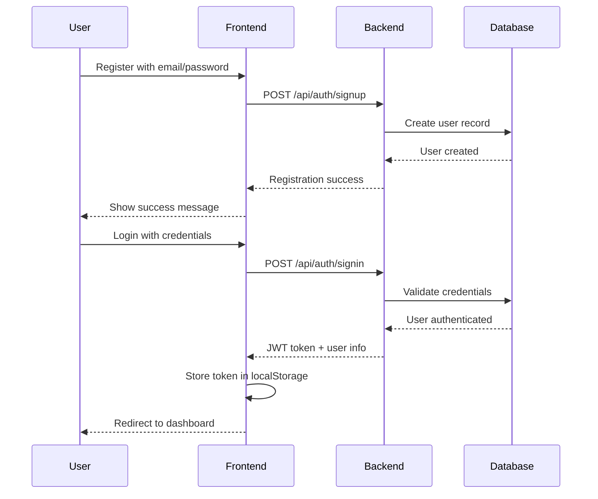
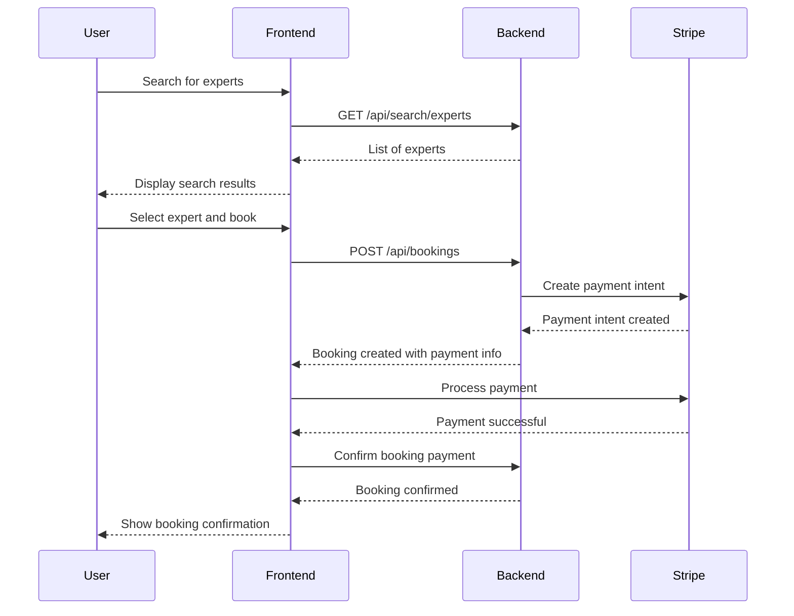

# Getting Started Guide

## Quick Start

This guide will help you get the Shop Experts platform up and running on your local development environment in just a few minutes.

## Prerequisites

Before you begin, ensure you have the following installed:

- **Java 8 or higher** (JDK 8+ recommended)
- **Maven 3.6 or higher**
- **Node.js 16 or higher**
- **npm 8 or higher**
- **Git** (for cloning the repository)

### Verify Prerequisites

```bash
# Check Java version
java -version

# Check Maven version
mvn -version

# Check Node.js version
node --version

# Check npm version
npm --version
```

## Installation Steps

### 1. Clone the Repository

```bash
git clone https://github.com/yourusername/shop-experts.git
cd shop-experts
```

### 2. Backend Setup (Terminal 1)

```bash
# Navigate to backend directory
cd backend

# Build the project
mvn clean install

# Run the Spring Boot application
mvn spring-boot:run
```

The backend will start on `http://localhost:8080`

### 3. Frontend Setup (Terminal 2)

```bash
# Navigate to frontend directory (from project root)
cd frontend

# Install dependencies
npm install

# Start the React development server
npm start
```

The frontend will start on `http://localhost:3000`

## Verification

### 1. Backend Verification

Visit these URLs to verify the backend is running:

- **API Health Check**: http://localhost:8080/actuator/health (if actuator is enabled)
- **H2 Database Console**: http://localhost:8080/h2-console
  - JDBC URL: `jdbc:h2:mem:shopexperts`
  - Username: `sa`
  - Password: `password`

### 2. Frontend Verification

- **Main Application**: http://localhost:3000
- The React app should load with the landing page

### 3. Integration Verification

Test the frontend-backend integration:

1. Open http://localhost:3000
2. Try to register a new user
3. Login with the created user
4. Navigate through the application

## Initial Data Setup

The application comes with initial data setup through `DataInitializer.java`:

### Default Users
- **Admin User**: 
  - Email: `admin@shopexperts.com`
  - Password: `admin123`
  - Role: ADMIN

- **Regular User**: 
  - Email: `user@shopexperts.com`
  - Password: `user123`
  - Role: USER

### Sample Data
- Sample expert profiles
- Sample categories
- Sample reviews

## Application Features Overview

```mermaid
graph TB
    subgraph "User Features"
        Registration[User Registration]
        Login[User Login]
        Profile[Profile Management]
        Search[Expert Search]
        Booking[Book Services]
        Reviews[Write Reviews]
        Rewards[Earn Rewards]
    end
    
    subgraph "Expert Features"
        ExpertProfile[Expert Profile Setup]
        ManageBookings[Manage Bookings]
        ViewReviews[View Reviews]
        Availability[Set Availability]
    end
    
    subgraph "Admin Features"
        UserManagement[User Management]
        ExpertVerification[Expert Verification]
        Analytics[View Analytics]
        ContentModeration[Content Moderation]
    end
    
    Registration --> Search
    Login --> Profile
    Search --> Booking
    Booking --> Reviews
    Reviews --> Rewards
    
    ExpertProfile --> ManageBookings
    ManageBookings --> ViewReviews
    ViewReviews --> Availability
    
    UserManagement --> ExpertVerification
    ExpertVerification --> Analytics
    Analytics --> ContentModeration
```



## Common Workflows

### 1. User Registration and Login Flow



### 2. Expert Search and Booking Flow



## Development Environment

### Hot Reloading

Both frontend and backend support hot reloading:

- **Frontend**: React development server automatically reloads on file changes
- **Backend**: Use Spring Boot DevTools for automatic restart on Java file changes

### Database

The application uses H2 in-memory database for development:

- **Advantage**: No installation required, fast startup
- **Consideration**: Data is lost on application restart
- **Console Access**: http://localhost:8080/h2-console

### File Storage

Files are stored locally in the `uploads/` directory:

```
backend/
├── uploads/
│   ├── profiles/     # User profile images
│   ├── reviews/      # Review photos
│   └── documents/    # Other documents
```

## Testing the Application

### Backend Tests

```bash
cd backend

# Run all tests
mvn test

# Run tests with coverage
mvn test jacoco:report

# Run specific test class
mvn test -Dtest=AuthControllerTest
```

### Frontend Tests

```bash
cd frontend

# Run all tests
npm test

# Run tests with coverage
npm run test:coverage

# Run specific test category
npm run test:components
npm run test:accessibility
npm run test:integration
```

## Troubleshooting

### Common Issues

#### 1. Port Already in Use

If port 8080 or 3000 is already in use:

```bash
# For backend (port 8080)
# Kill process using port 8080
lsof -ti:8080 | xargs kill -9

# Or change port in application.properties
server.port=8081

# For frontend (port 3000)
# Kill process using port 3000
lsof -ti:3000 | xargs kill -9

# Or set different port
PORT=3001 npm start
```

#### 2. Maven Build Issues

```bash
# Clear Maven cache and rebuild
mvn clean
rm -rf ~/.m2/repository
mvn install
```

#### 3. Node.js Issues

```bash
# Clear npm cache
npm cache clean --force

# Delete node_modules and reinstall
rm -rf node_modules package-lock.json
npm install
```

#### 4. Database Connection Issues

Check H2 console at http://localhost:8080/h2-console with:
- JDBC URL: `jdbc:h2:mem:shopexperts`
- Username: `sa`
- Password: `password`

#### 5. CORS Issues

If you encounter CORS errors:
1. Verify backend is running on port 8080
2. Check CORS configuration in `WebConfig.java`
3. Ensure frontend proxy is configured in `package.json`

### Getting Help

1. **Check the logs**: Both frontend and backend provide detailed console logs
2. **H2 Console**: Use the database console to inspect data
3. **Network Tab**: Use browser developer tools to inspect API calls
4. **Documentation**: Refer to the detailed API documentation in the `docs/` folder

## Next Steps

After getting the application running:

1. **Explore the Architecture**: Read the [System Architecture Overview](../architecture/system-overview.md)
2. **API Documentation**: Check out the [API Documentation](../api/)
3. **Development Setup**: Follow the [Development Setup Guide](development-setup.md)
4. **Testing Guide**: Learn about [Testing Strategies](testing-guide.md)
5. **Deployment**: When ready, follow the [Deployment Guide](deployment.md)

## Quick Reference

### Essential URLs
- Frontend: http://localhost:3000
- Backend API: http://localhost:8080
- H2 Console: http://localhost:8080/h2-console
- API Docs: [docs/api/](../api/)

### Default Credentials
- Admin: `admin@shopexperts.com` / `admin123`
- User: `user@shopexperts.com` / `user123`

### Key Commands
```bash
# Start backend
cd backend && mvn spring-boot:run

# Start frontend
cd frontend && npm start

# Run tests
cd backend && mvn test
cd frontend && npm test

# Build for production
cd backend && mvn clean package
cd frontend && npm run build
```
